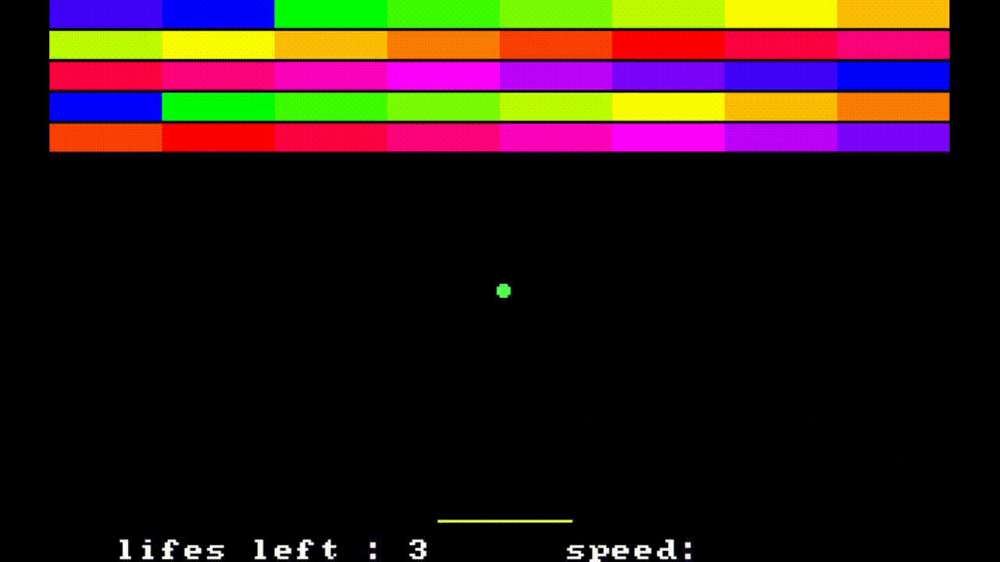

# Atari-Breakout




Getting started
---------------

#### Dependencies

* 8086 16bit Emulator ([Dosbox](https://www.dosbox.com/))
* A compiler with 16bit support ([Tasm](data.cyber.org.il/assembly/TASM.rar/))


#### Building from source

To download the source files type the following command in terminal:
    ```
      git clone --detph 1 https://github.com/Flodur871/Atari-Breakout
    ```

Afterwards you should have a folder Atari-Breakout/src somewhere in your pc, extract TASM.rar bin folder content in it.
To get there in dosbox terminal type the following commands:
    
    ```
      mount <disk> <disk>:/
      cd <path>/Atari-Breakout/src
    ```

Finally compile the project using tasm and tlink with these commands:

    ```
      tasm break.asm
      tlink break.asm
    ```

#### Playing the game

1. Change your current directory to Atari-Breakout/src as instructed in the building from source section.
2. Run break.exe


<table>
        <thead>
        <tr>
            <th>Command</th>
            <th>Keybind</th>
        </tr>
    </thead>
    <tbody>
        <tr>
            <th>Move Right</th>
            <td><kbd>A</kbd></td>
        </tr>
        <tr>
            <th>Move Left</th>
            <td><kbd>D</kbd></td>
        </tr>
        <tr>
            <th>Restart/Change bricks colors</th>
            <td><kbd>Space</kbd></td>
        </tr>
        <tr>
            <th>Pause</th>
            <td><kbd>Escape</kbd></td>
        </tr>
    </tbody>
</table>
